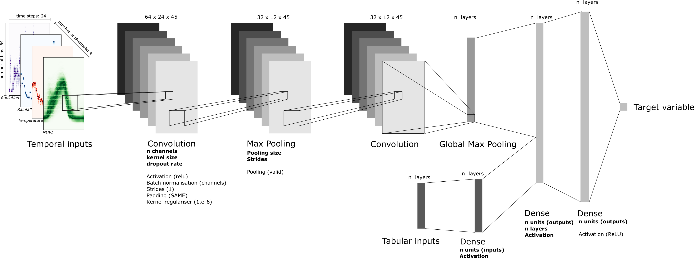

# Lean Temporal Convolutional Neural Network for yield forecasting
Training temporal Convolution Neural Networks (CNNs) on satellite image time series for yield forecasting.




## Prerequisites
To set up the environment:

```
git clone https://github.com/waldnerf/yieldCNN.git
cd yieldCNN
conda env create -f environment.yml
conda activate leanyf
```

If a GPU is available, then type in:
```pip install tensorflow-gpu==2.3.0```

You can monitor GPU usage with the following command: 
```watch -n 1 nvidia-smi```

## To do
-  [ ] merge preprocessing
-  [ ] normalisation per province 
Normalization 
(2021-07-27) Two options now:  
1) read raw data and normalize min max over the whole data set after train/test/val split 
2) read normalized (by histo image) and normalize min max over the whole data set after train/test/val split (note that this latter norm has no effect because all data are already 0-1) 
Data generator delas with both norm and unorm because in any case normalise per image to add error (then norm back to orginal units) 
In option 2 each image gets the same scale of values (0-1). This means that for a given region, both a good year and a bad year (in terms of yield) will have some grid cells with 1 (the most represented profile). Another option can be tested: 
3) read data normalized by region (all histos of a region) 
Note: after this option 3, the norm min max over the whole data set after train/test/val split should be turned off. 

- [ ] Validation, Validation is now on one single year (no inner loop). We may consider increasing the number of years 
- [ ] Trend, Trend data (in a way or another) could be passed after CNN 

## Contributors
 - [Dr. Franz Waldner](https://scholar.google.com/citations?user=4z2zcXwAAAAJ&hl=en&oi=ao)


