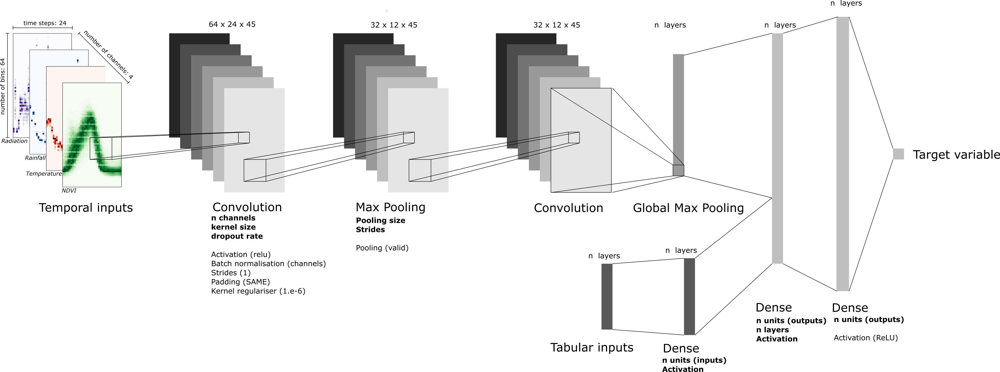

# Lean Temporal Convolutional Neural Network for yield forecasting

Training temporal Convolution Neural Networks (CNNs) on satellite image time series for yield forecasting.

### Table of contents
* [Prerequisites](#prequisites)
* [Technologies](#technologies)
* [Setup](#setup)





## Prerequisites
To set up the environment:

```
git clone https://github.com/waldnerf/yieldCNN.git
cd yieldCNN
conda env create -f environment.yml
conda activate leanyf
```

If a GPU is available, then type in:
```pip install tensorflow-gpu==2.3.0```

You can monitor GPU usage with the following command: 
```watch -n 1 nvidia-smi```

## Directory tree structure

Below is the directory tree structure of the project. To run the project, one only needs the ```raw_data``` folder to be 
populated. Other folders are created automatically.

```
leanyf
├── data
│       ├── meta
│       └── params
│           └── Archi_{model_name}_{normalisation}_{input_size}
│                └── crop_{index}
│                    ├── month_{forecast}
│                        └── best_model
├── figures
└── raw_data
```

Aggregated results are stored in ```data/model_evaluation_{input_data}CNN.csv```.

## Script overview

As a helper, certain variables have been hardcoded in ```mysrc/constants.py```. 


Scripts were named as explicitly as possible. Here is a short description of the main ones:
* ```preprocess_1D_inputs.py```: Convert tabular data into arrays usable by a 1D CNN. Arguments are defined in ```mysrc/constants.py```.
* ```preprocess_2D_inputs.py```: Format tabular data into arrays usable by a 2D CNN and save them as ```pickles``` with  the ```dill``` package. It is recommended to re-run this step on the machines where the code will run. 
* ```optimise_so_1D_architectures.py```: Full model optimisation and evaluation for 1D input data.
* ```optimise_so_2D_architectures.py```: Full model optimisation and evaluation for 2D input data. 
* ```optimise_so_2D_architectures_data_augmentation_data_from_Aug.py```: Full model optimisation and evaluation for 2D input data with augmentation. 
* ```optimise_so_p2D_architectures.py```: Full probabilistic model optimisation and evaluation for 2D input data. Needs to be updated.
* ```launcher_1D.sh```: Submit ```optimise_so_1D_architectures.py``` on AWS.
* ```launcher_2D.sh```: Submit ```optimise_so_12D_architectures.py``` on AWS.

Models have been developed in the ```deeplearning``` folder:
* ```architecture_complexity_1D.py```: Architecture definition of 1D models
* ```architecture_complexity_2D.py```: Architecture definition of 1D models
* ```architecture_complexity_p2D.py```: Architecture definition of 2D probabilistic models
* ```architecture_features.py```: Defining tensorflow.keras architecture, and training the models


## To do
-  [x] merge preprocessing
-  [ ] normalisation per province 
Normalization 
(2021-07-27) Two options now:  
1) read raw data and normalize min max over the whole data set after train/test/val split 
2) read normalized (by histo image) and normalize min max over the whole data set after train/test/val split (note that this latter norm has no effect because all data are already 0-1) 
Data generator delas with both norm and unorm because in any case normalise per image to add error (then norm back to orginal units) 
In option 2 each image gets the same scale of values (0-1). This means that for a given region, both a good year and a bad year (in terms of yield) will have some grid cells with 1 (the most represented profile). Another option can be tested: 
3) read data normalized by region (all histos of a region) 
Note: after this option 3, the norm min max over the whole data set after train/test/val split should be turned off. 

- [ ] Validation, Validation is now on one single year (no inner loop). We may consider increasing the number of years 
- [ ] Trend, Trend data (in a way or another) could be passed after CNN 

## Contributors
 - [Dr. Franz Waldner](https://scholar.google.com/citations?user=4z2zcXwAAAAJ&hl=en&oi=ao)
 - [Dr. Michele Meroni](https://scholar.google.com/citations?user=iQk-wj8AAAAJ&hl=en&oi=ao)

